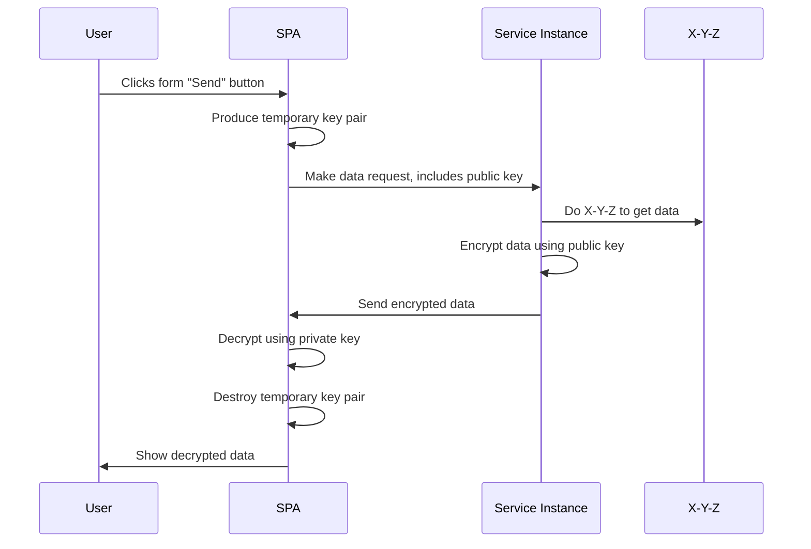
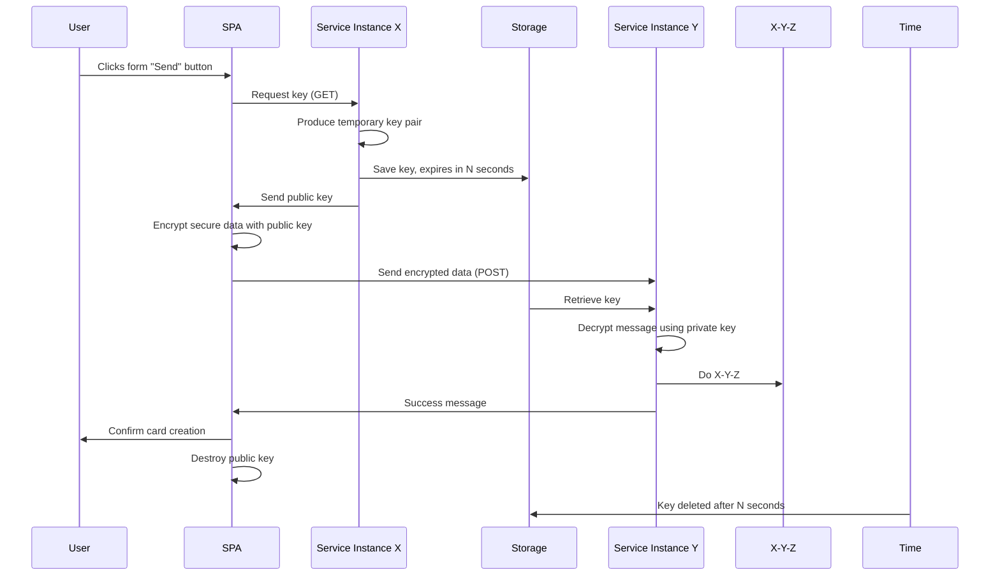

# ok2cry
- You: Wow! I love this. I want to use this to encrypt everything, everywhere, always. 
- Me: You can't. Or at least you shouldn't. And yes, it's ok2cry.

This project is here to show that it's OK to use cryptography. It's about how to use simple, disposable PKI without the tears. And without the ~~bitcon~~ ~~bitcoin~~ bitcon.

Cryptography is everywhere, and it's free. So you can and should use it liberally and, with ok2cry, disposably
- your programming language and OS have cryptographic tools
- mobile devices have cryptographic tools
- embedded devices, even very small and cheap kits, have cryptographic tools
- web browsers, including ~~Oprah~~ Opera, have a built-in cryptographic tools

# Examples
- Protect data end-to-end from a server to a client
- Protect data end-to-end from a client to a server
- Protect data end-to-end from a server to a server (peers)
- Protect data end-to-end from a client to a client (peers) 

### Hold on there ... we've got TLS for that, and it's fine.
Yes, yes you do. And it's great. And in many cases it's good enough. You can move on.

### Er, OK ... just before I leave, quick follow up. When isn't TLS good enough?
It's not great for every situation. Here are a few examples:
- did we say it's end-to-end
  - it's end-to-end. Probably for that.
- organisation constraints
  - you don't have any cryptography in the organisation, but you want to protect specific messages in a way that's simple and does not impose a management burden.
  - you do have encryption but there is a lot of overhead in getting it set-up, and you only want it for a few specific cases. Or, more likely, just one.
- as an add-on to your identity system
  - your users get logged in but your identity system doesn't do encryption. Few of them do. Even fewer offer end-to-end encryption.
- you want to protect data after it exits TLS but before it hits your service. 
  - you can't risk having that data written into logs
  - you don't want anyone except the person entering the data and your service accessing the data ie it's end-to-end. Yes this is the same as the first point but more words can help. And repetition is soothing.
- you want to send data to a client and be sure that only that one, exact client can read it.
  - TLS is a general, universal way to protect data for anybody that uses your service. 
  - One way TLS used in browsers, does not help in restricting data visibility per client, by design.
- you don't want enterprise TLS interceptors to read the message.
  - you've got nothing to hide, or maybe you do. Either way you don't want them peeking. You like privacy cos... it's a human right, maybe?

### Maybe, I'll stick around. 
Thanks.

### So, is this an identity system?
Ah, no. Definitely not. And that's why you can't use it for everything, everywhere, always. It ok2cry, it really is.

You should know that PKI based identity platforms don't give you a perfect, admin free version of secrecy either. There is always a key to protect, manage and share. Or a set of keys. If it's done well, you will hardly notice it, but it's there. The burden is always there. And it's fine. Usually.

You can use it as a value add to your identity system though. More on how to integrate with OIDC based systems [is here ... link tbc]

### Hang on though, don't you use keys. I'm getting a headache. Maybe I do want to cry.
It's ok2cry. It really is. I encourage it.
Maybe you missed the **disposable** part of the explanation at the beginning? It was a while ago. It's so good that you came this far.

ok2cry is a way to use cryptography for just one message at a time. Nothing about these keys is tied to your identity. Every key lasts for the duration of the message exchange and then its thrown away. Whoosh, and it's gone. 

Meanwhile, your message was always perfectly encrypted between the two ends of the string. It's not a string, but I'm trying a little poetry here, so work with me. Poetry and repetition are soothing.

### Isn't cryptography horribly inefficient? Are you burning the planet too?
Excuse me, no. Where are my pearls? I need to clutch. No, absolutely not. 

This is not bitcon mining. It's very efficient to produce keys. The most commonly used CPUs (mobile, PC) have direct support for cryptography. Even tiny IOT style embedded CPUs / SOCs have cryptographic support eg the [ESP32](https://en.wikipedia.org/wiki/ESP32#Features). You can buy one for less than $10.

## OK, let's see how it works
Here are two examples:
- **client initiated**: a browser-based Single Page Application can give the server a key so that it, and only it, can read a message encrypted with the key and returned by the server.
- **server initiated**: a server gives a public key so that it, and only it, can ever read a message encrypted with the key by the client.

### Client produces temporary key

More examples and documentation notes are in the [Client key documentation](docs/client-key.md).

### Server produces temporary key

More examples and documentation notes are in the [Server key documentation](docs/server-key.md).
