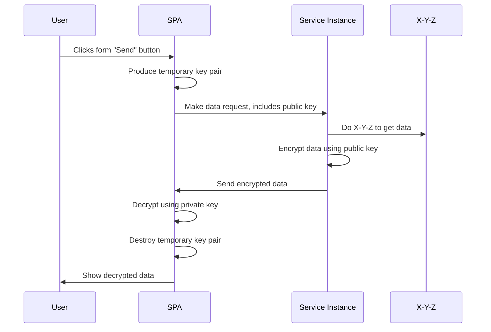
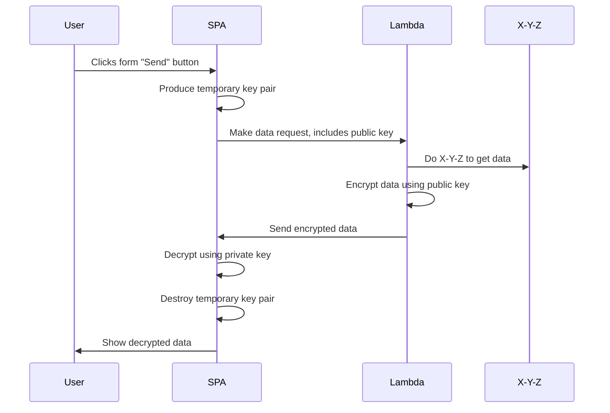

# Client produces disposable key

## No data store required
Do not be tempted to store the keys in the device or the browser. Create a new one per call or after a failed call.

The ok2cry library takes care of this for you if you prefer not to roll your own.

## Service example

## Serverless example

