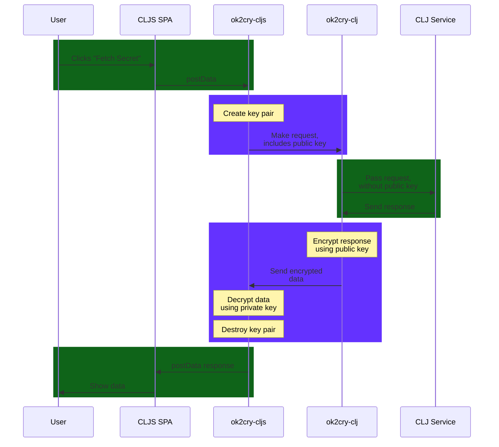

```mermaid
sequenceDiagram
rect rgb(15, 100, 25)
User->>CLJS SPA: Clicks "Fetch Secret"
CLJS SPA->>ok2cry-cljs: postData
end 
rect rgb(100, 50, 255)
Note over ok2cry-cljs: Create key pair
ok2cry-cljs->>ok2cry-clj: Make request,<br>includes public key
end 
rect rgb(15, 100, 25)
ok2cry-clj->> CLJ Service: Pass request, <br>without public key
CLJ Service->>ok2cry-clj: Send response
end 
rect rgb(100, 50, 255)
Note over ok2cry-clj: Encrypt response<br>using public key
ok2cry-clj->>ok2cry-cljs: Send encrypted<br>data
Note over ok2cry-cljs: Decrypt data<br>using private key
Note over ok2cry-cljs: Destroy key pair
end
rect rgb(15, 100, 25)
ok2cry-cljs->>CLJS SPA: postData response
CLJS SPA->>User: Show data
end 
```
