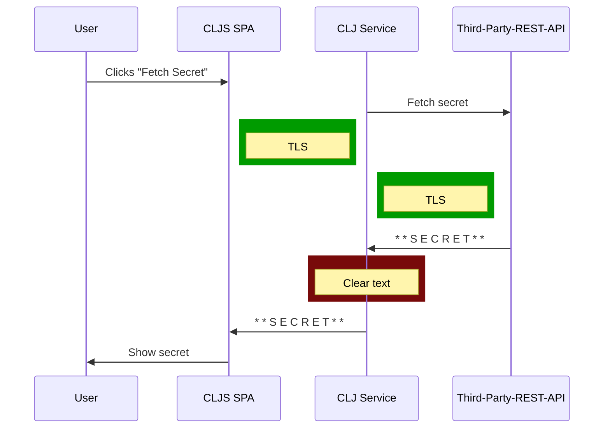

```mermaid
sequenceDiagram
User->>CLJS SPA: Clicks "Fetch Secret"
CLJ Service->>Third-Party-REST-API: Fetch secret
rect rgb(0, 155, 0)
Note left of CLJ Service: TLS
end
rect rgb(0, 155, 0)
Note right of CLJ Service: TLS
end
Third-Party-REST-API->>CLJ Service: * * S E C R E T * *
rect rgb(120, 10, 10)
Note over CLJ Service: Clear text
end 
CLJ Service->>CLJS SPA: * * S E C R E T * *
CLJS SPA->>User: Show secret
```
