# Motivation

Server to server calls for highly confidential data

## Security Problem

The S E C R E T is visible on the server. Trust is required between the two parties.

## Conceptual Security Solution

```mermaid
sequenceDiagram
User->>CLJS SPA: Clicks "Fetch Secret"
CLJS SPA->>ok2cry: updatePayload
ok2cry->>ok2cry: Create Key Pair
ok2cry->>CLJS SPA: payload and Public Key
CLJS SPA->>CLJ Service: Send Request with Public Key
rect rgb(0, 155, 0)
Note left of CLJ Service: TLS
end
rect rgb(0, 155, 0)
Note right of CLJ Service: TLS
end
CLJ Service->>Third-Party-REST-API: Request Secret with Public Key
Third-Party-REST-API->>Third-Party-REST-API: Encrypt data with Public Key
Third-Party-REST-API->>CLJ Service: ENCRYPTED-RESPONSE
CLJ Service->>CLJS SPA: ENCRYPTED-RESPONSE
CLJS SPA->>ok2cry: decrpytPayload
ok2cry->>ok2cry: Destroy Key Pair
ok2cry->>CLJS SPA: plain text payload
CLJS SPA->>User: Show secret
```

### Practical problems

Agreeing a key scheme and security process between the two companies is difficult.

The Third Party service usually has several clients and would prefer a standard solution.

## Practical solution

sequenceDiagram
User->>CLJS SPA: Clicks "Fetch Secret"
CLJS SPA->>ok2cry: updatePayload
ok2cry->>ok2cry: Create Key Pair
ok2cry->>CLJS SPA: payload and Public Key
CLJS SPA->>CLJ Service: Send Request with Public Key
rect rgb(0, 155, 0)
Note left of CLJ Service: TLS
end
rect rgb(0, 155, 0)
Note right of CLJ Service: TLS
end
CLJ Service->>Third-Party-REST-API: Request Secret with Public Key
Third-Party-REST-API->>Third-Party-REST-API: Obtain / generate confidential data
Third-Party-REST-API->>ok2cry-lib: Encrypt data with Public Key
ok2cry-lib->>Third-Party-REST-API: ENCRYPTED DATA
rect rgb(0, 155, 0)
Third-Party-REST-API->>CLJ Service: ENCRYPTED-RESPONSE
end
rect rgb(0, 155, 0)
CLJ Service->>CLJS SPA: ENCRYPTED-RESPONSE
end
CLJS SPA->>ok2cry: decrpytPayload
ok2cry->>ok2cry: Destroy Key Pair
ok2cry->>CLJS SPA: plain text payload
CLJS SPA->>User: Show secret

