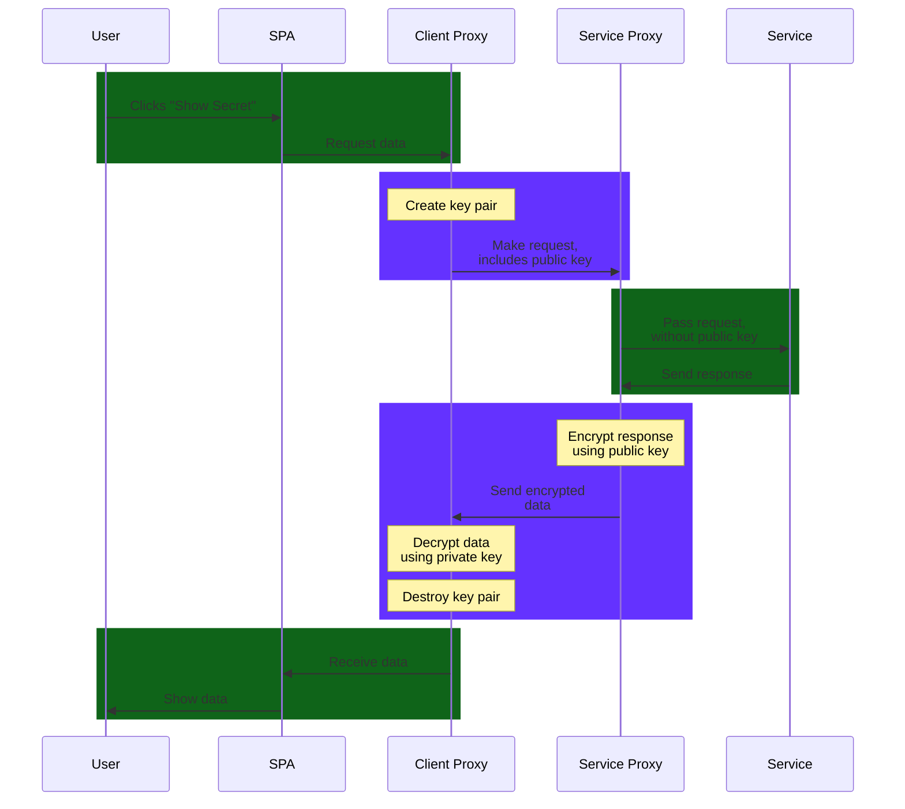

```mermaid

sequenceDiagram
rect rgb(15, 100, 25)
User->>SPA: Clicks "Show Secret"
SPA->>Client Proxy: Request data
end 
rect rgb(100, 50, 255)
Note over Client Proxy: Create key pair
Client Proxy->>Service Proxy: Make request,<br>includes public key
end 
rect rgb(15, 100, 25)
Service Proxy->> Service: Pass request, <br>without public key
Service->>Service Proxy: Send response
end 
rect rgb(100, 50, 255)
Note over Service Proxy: Encrypt response<br>using public key
Service Proxy->>Client Proxy: Send encrypted<br>data
Note over Client Proxy: Decrypt data<br>using private key
Note over Client Proxy: Destroy key pair
end
rect rgb(15, 100, 25)
Client Proxy->>SPA: Receive data
SPA->>User: Show data
end 

```
