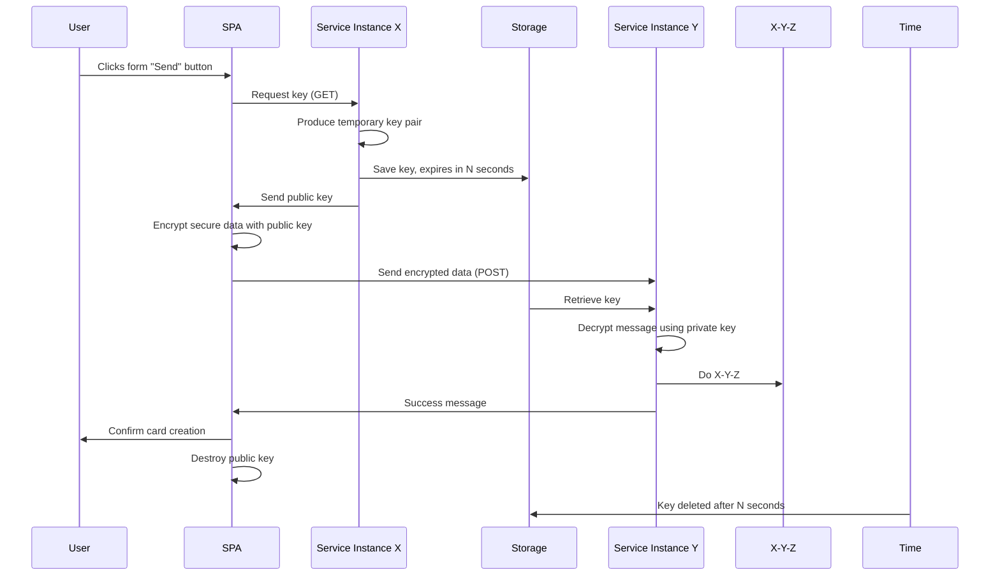
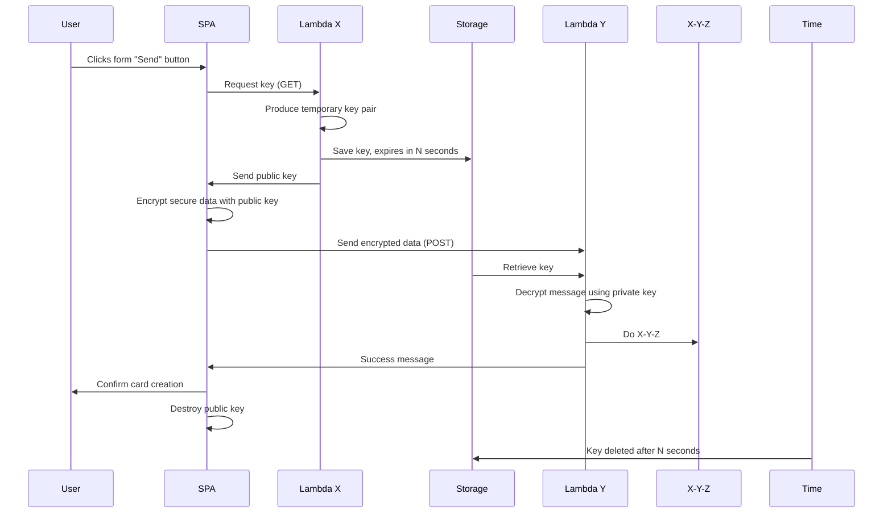

# Server produces disposable keys

## Data store with automated expiry
When servers produce keys they must have a shared store that can reliably and automatically delete data within a short time window.

### Shared caches
TTL expiry is a core feature of cache services such as `memcached` and `REDIS`.

### Cloud databases?
The AWS `DynamodDB` offers TTL on data but its reliability over [short time windows is unconvincing](https://docs.aws.amazon.com/amazondynamodb/latest/developerguide/howitworks-ttl.html) as of this writing:

> Depending on the size and activity level of a table, the actual delete operation of an expired item can vary. Because TTL is meant to be a background process, the nature of the capacity used to expire and delete items via TTL is variable (but free of charge). TTL typically deletes expired items within 48 hours of expiration.

### Don't DIY
:warning: It's tempting to have the server or some batch job clean up the keys but this temptation must be resisted. It is very difficult to ensure reliable clean up in all cases.

## Service example

## Serverless example

