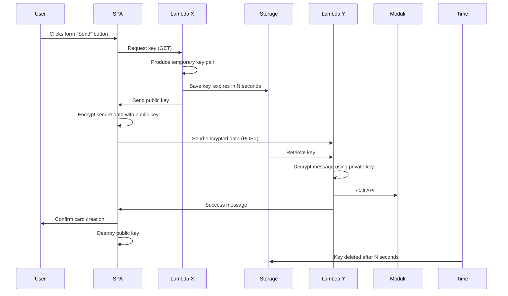

# Server produces disposable keys

```mermaid
sequenceDiagram
User->>SPA: Clicks form "Send" button
SPA->>Lambda X: Request key (GET)
Lambda X->>Lambda X: Produce temporary key pair            
Lambda X->>Storage: Save key, expires in N seconds            
Lambda X->>SPA: Send public key
SPA->>SPA: Encrypt secure data with public key
SPA->>Lambda Y: Send encrypted data (POST)
Storage->>Lambda Y: Retrieve key
Lambda Y->>Lambda Y: Decrypt message using private key
Lambda Y->> Modulr: Call API
Lambda Y->>SPA: Success message
SPA->>User: Confirm card creation
SPA->>SPA: Destroy public key
Time->>Storage: Key deleted after N seconds
```
